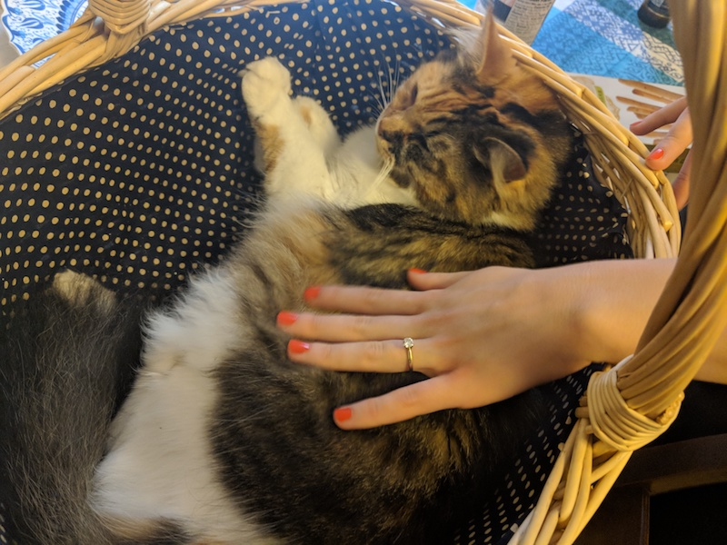

# Cat Clicker App

This app will be built while completing the lessons in Udacity's first unit on front end application developement, Changing Expectations. It is based on Ben Jaffe's original online hit game, Cow Clicker

### Version One Requirements

#### Visuals

- The application should display a picture of a cat and a number of clicks.
- The specifics of the layout do not matter, so style it however you'd like.

#### Interaction

- The number of clicks should increment when the cat picture is clicked.

#### Inspiration

Alma!!!

